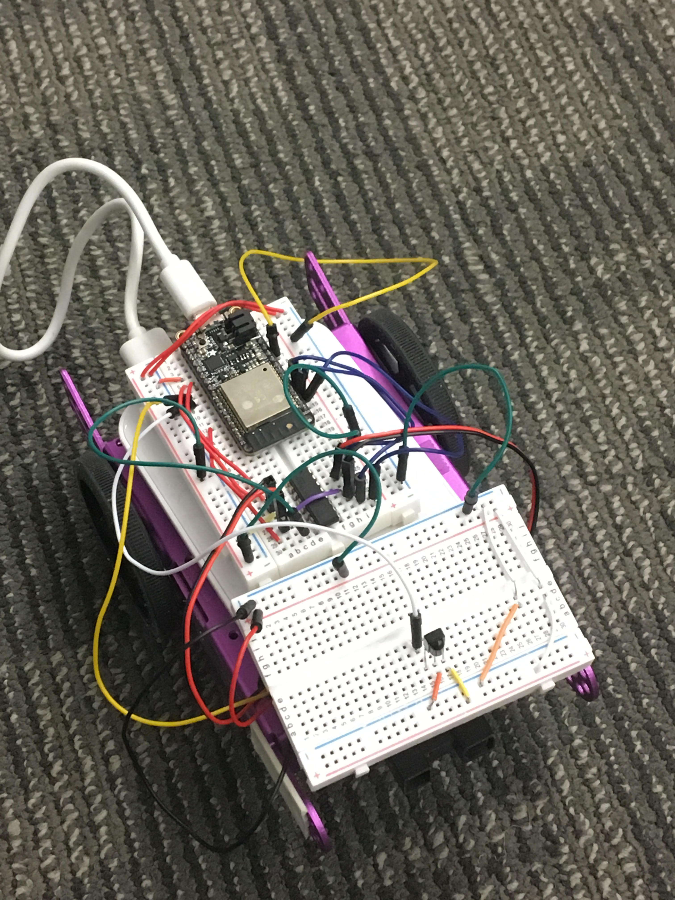
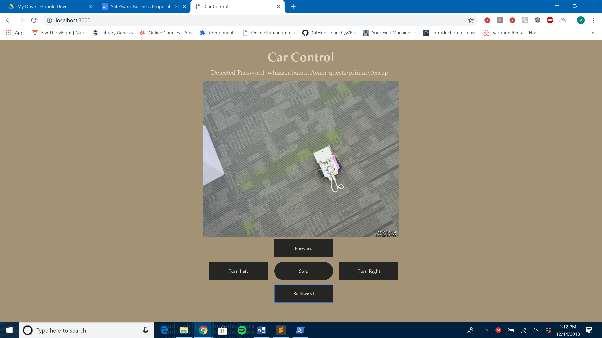

Authors: Brian Xu, Gerard Devlin, Varun Malikayil 2018-12-6

## Summary
 In this quest, we were tasked with implementing a remote controlled car with IR signal capabilities as well as communication through a Wifi network. This car was tasked to be controllable/navigated through a remote client, read an IR signal from multiple beacons spread across an obstacle course, and parse together a URL displaying a success message. In addition, an RPi with a live video feed will be implemented showing the course, allowing a remote user to navigate through the course.

## Evaluation Criteria

We decided on the following specifications for a successful solution to this quest:

 - Car can be controlled remotely through network (Goes forward, reverse, rotate left, rotate right)
 - Car can decode IR signal from beacons and parse a URL without corrupt data
 
 - Client outputs the success message URL
 - Client can control car successfully
 
## Solution Design
We used a Huzzah32 board (based on the the ESP32 board) wired to control a car over the wifi network. The microcontroler acts as server which responds to commands such as forward, reverse, turn left, and turn right from a web client. The Rpi host a webcam that is live fed to the client as well. 

Car Build Details: 
- IR Receiver : GPIO Pin A3. Receives code and ID information through IR.
- H bridge : GPIO Pins A0, A1, MO, 14, 15, 32. Used to control the wheels of the car.

## Sketches and Photos

 Car :

 Client Output :

## Modules, Tools, Source Used in Solution

- [Webcam Setup](https://pimylifeup.com/raspberry-pi-webcam-server/)
- [HTTP Request](https://www.npmjs.com/package/request)
- [H bridge wiring](http://www.modularcircuits.com/blog/articles/h-bridge-secrets/h-bridges-the-basics/)

## Supporting Artifacts

- [Github repo for our solution](https://github.com/BU-EC444/Quest6-Team15-Xu-Devlin-Malikayil/tree/master/code)
- [Youtube video summary](https://www.youtube.com/watch?v=8aNvEg5u-OI)
