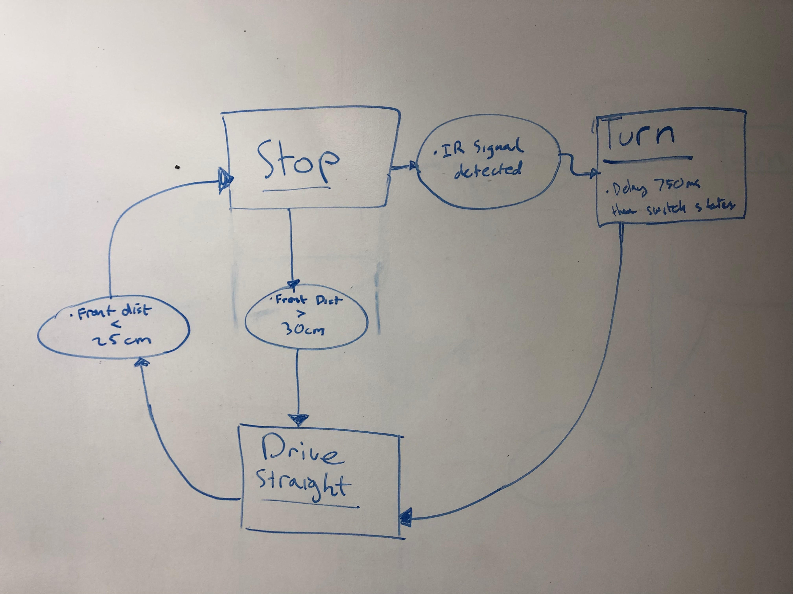
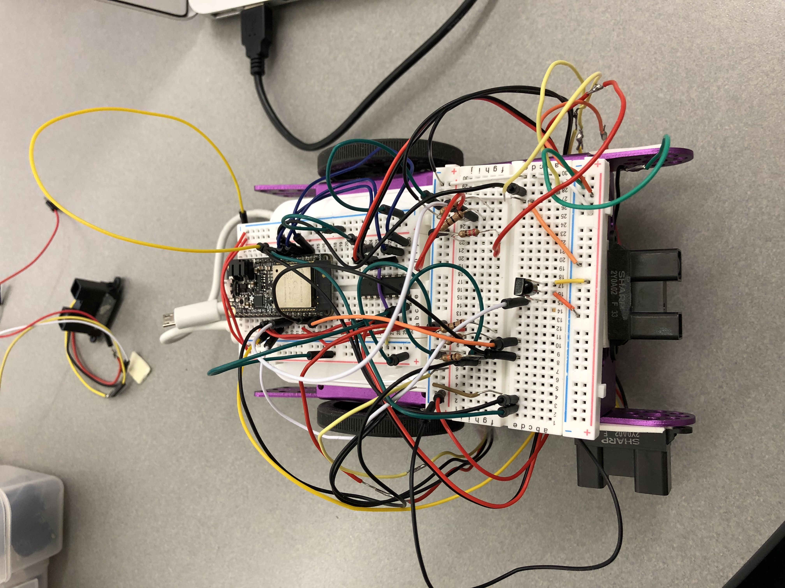
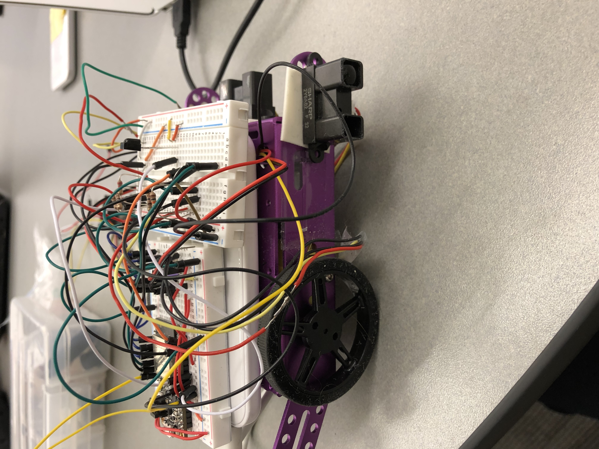

Authors: Brian Xu, Gerard Devlin, Varun Malikayil 2018-11-16

## Summary
 In this quest, we were tasked with implementing a self navigating car. The car has to successfully run through an obstacle course without hitting any walls and stopping in the correct situations. 
 The course is setup in the shape of a rectangle with an IR beacon on each corner. The task for the device is to start at one corner of the course and navigate through the course without hitting any of the walls and obstacles placed within. In order to acheive this, we used sensors to communicate both front and side distances to the ESP32 and have the device change state based on the received information and react accordingly.
 

 
## Evaluation Criteria

We decided on the following specifications for a successful solution to this quest:

 - Utilize IR rangefinder as a side distance sensor. Used to communicate distance from the edge of a wall.
 - Utilize IR rangefinder as a front distance sensor. Used to detect obstacles/walls.
 - Utilize H-bridge to be able to reverse polarity of voltage given to motors. This allows us to move backwards and frontwards.
 - Utilize DC motors to move the device.
 - Utilize PID to guide the device and keep it on course at all times and keep it the right distance away from the wall on the side.
 - Utilize IR receiver in order to read and navigate from IR beacons set up throughout the course.
 - Utilize MCPWM to turn and stop the device.
 
## Solution Design
We used Huzzah32 boards (based on the the ESP32 board) as the main processors in this quest. The ESP32 is interfaced to read the sensor readings as well as decide what actions to take based on the readings. 

- IR Range Finder - Side Sensor : Uses GPIO pin 34 to read temperature
 - IR Range Finder - Front Sensor : Uses GPIO pin 33 to detect obstacles in front of the device.
- IR Receiver Component : Uses GPIO pin 26 for 
- DC Motor Terminals : Connect to the H-bridge
- H-bridge Component - Interfaces DC Motors to ESP32, allows 

The device runs based on a state model telling the device what to do. Our states include:

1. Stopped - Stop when front sensor senses obstacle AND no IR signal detected. Wait for user interference.
2. Driving Straight - Drive straight by default, calibrated by using PID w/ the side sensor.
3. Turn - Turn 90 degrees if front sensor detects obstacle and IR signal is detected. This means that the car is in a corner of the course and needs to turn.

## Sketches and Photos

 Device State Diagram :

 Device + Wiring (Overhead) :

 Device + Wiring (Side View) :

## Modules, Tools, Source Used in Solution

- [Sharp IR Rangefinder](https://www.sparkfun.com/datasheets/Sensors/Infrared/gp2y0a02yk_e.pdf)
- [H bridge wiring](http://www.modularcircuits.com/blog/articles/h-bridge-secrets/h-bridges-the-basics/)
- [ESP RMT API](https://docs.espressif.com/projects/esp-idf/en/latest/api-reference/peripherals/rmt.html#)
- [PID design pattern](http://whizzer.bu.edu/guides/design-patterns/dp-pid)

## Supporting Artifacts

- [Github repo for our solution](https://github.com/BU-EC444/Quest4-Team15-Xu-Devlin-Malikayil/tree/master/Code)
- [Youtube video demo](https://www.youtube.com/watch?v=PcymvZEJ5A8)
